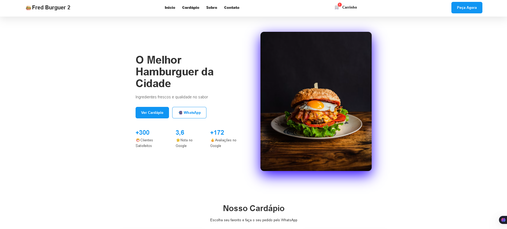

# 🍔 Fred Burguer 2 - Hamburgueria E-Commerce

> Website moderno, responsivo e de alta conversão desenvolvido para hamburguerias e restaurantes. Desenvolvido com HTML, CSS e JavaScript puros (Vanilla JS) para máxima performance, contando com carrinho de compras, formulário de entrega e fechamento de pedidos integrado diretamente ao WhatsApp e Google Sheets.

---

## 📱 Preview do Projeto

Abaixo você pode ver uma demonstração visual do layout do site. 

*Para colocar a foto do seu site aqui, adicione uma imagem chamada `preview.png` em uma pasta chamada `assets` e suba junto no seu repositório!*

---

## 🚀 Principais Recursos

- **⚡ Cardápio Dinâmico e Responsivo**: Layout premium adaptável para computadores, tablets e smartphones (Mobile-first).
- **🛒 Carrinho de Compras com Persistência**: Adicione, altere quantidades e remova lanches com facilidade. Os itens permanecem salvos mesmo se o cliente atualizar a página, graças ao uso do `localStorage`.
- **📦 Modal Interativo de Produtos**: Detalhes do item com controle dinâmico de quantidade antes de adicionar ao carrinho.
- **📝 Checkout Simplificado**: Formulário intuitivo para coletar nome, telefone e endereço completo do cliente.
- **📲 Integração Direta com WhatsApp**: Envia a mensagem do pedido formatada, detalhada e pronta para o WhatsApp do estabelecimento com apenas um clique.
- **📊 Banco de Dados no Google Sheets (Opcional)**: Integração via Google Apps Script que salva automaticamente todas as vendas em uma planilha no Google Drive para controle financeiro e histórico de pedidos.

---

## 🛠️ Tecnologias Utilizadas

- **HTML5**: Estrutura semântica e otimizada para SEO.
- **CSS3**: Estilos e animações fluidos, modernos e 100% responsivos.
- **JavaScript (Vanilla)**: Lógica do carrinho de compras, controle de estado e integração sem dependências externas (site super leve).
- **Google Apps Script**: API/Backend serverless para comunicação rápida com planilhas Google.

---

## 🎓 Sobre o Desenvolvedor

Este projeto foi construído e aprimorado por mim, desenvolvedor em constante evolução e aluno ativo do **DevClub** (comunidade de ensino de programação liderada por Rodolfo Mori). Focado em dominar as tecnologias de ponta do desenvolvimento web de forma prática e aplicada ao mercado de trabalho real.

---

*Gostou do projeto? Sinta-se à vontade para dar uma ⭐ no repositório!*
